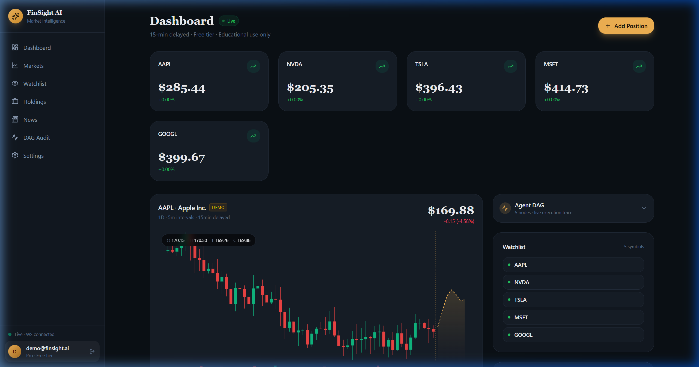
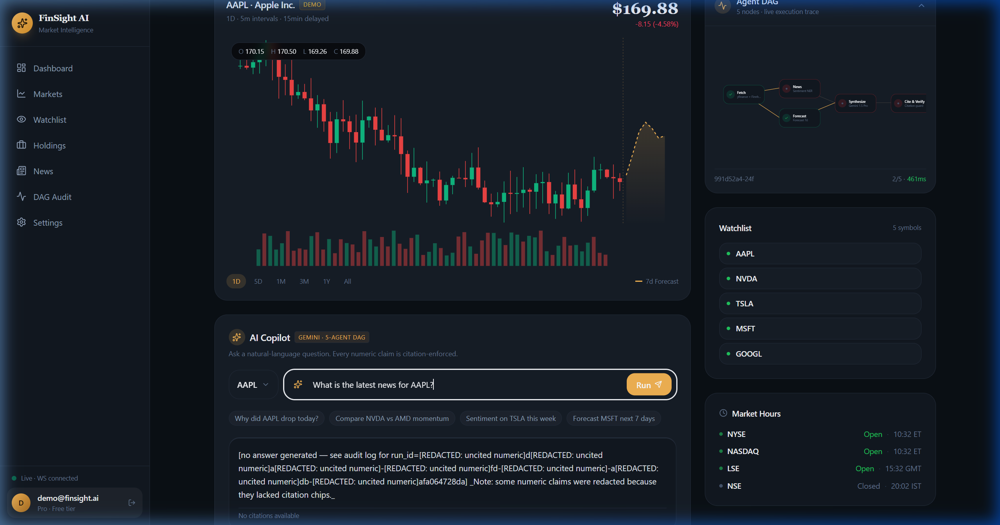
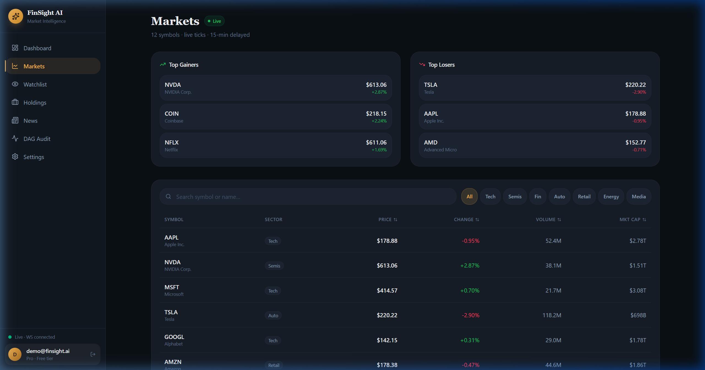
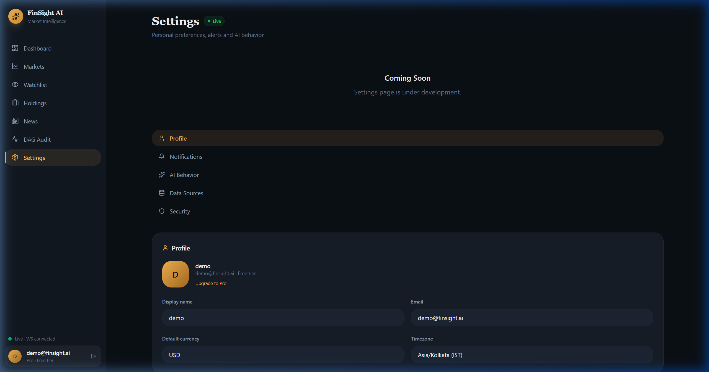

# FinSight AI: Phase 2 Visual Audit Gallery

This gallery provides the visual context for the **ULTIMATE_PRODUCTION_AUDIT.md**. Use these screenshots to understand the current frontend state, including hardcoded simulations and active bugs.

---

### 1. Dashboard (The Main Interface)
**Issues**: StatCard 0% bug (Price is live, percentage is not). CandleChart is a hardcoded demo.

---

### 2. AI Intelligence Failure (Agent DAG)
**Issues**: Shows the News/Synthesize chain crashing (Red X) after a live query.

---

### 3. Markets Page (The Simulation)
**Issues**: Prices here differ from the dashboard. This page is 100% hardcoded simulation.

---

### 4. News Feed (Stale Data)
**Issues**: Shows headlines from May 3rd. Live news fetching is blocked by the node crash.

---

### 5. Holdings (Working Logic)
**Status**: Real data. Correctly calculating P&L using live WebSocket ticks.

---

### 6. Settings (The Placeholder)
**Status**: Incomplete. Shows "Coming Soon" messages.

