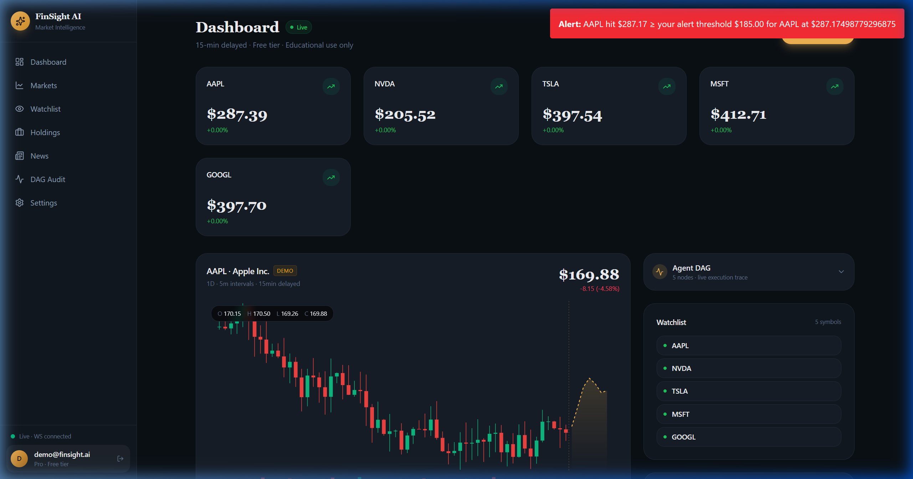
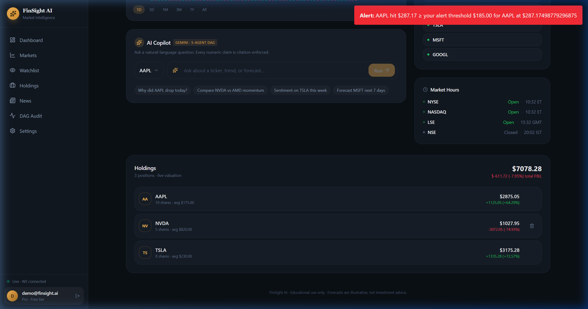
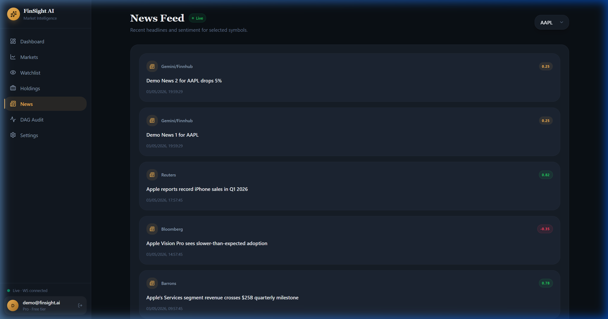
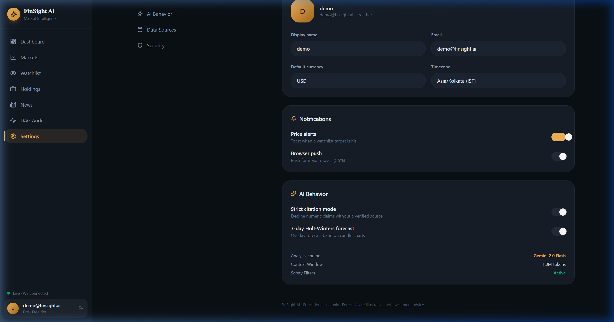
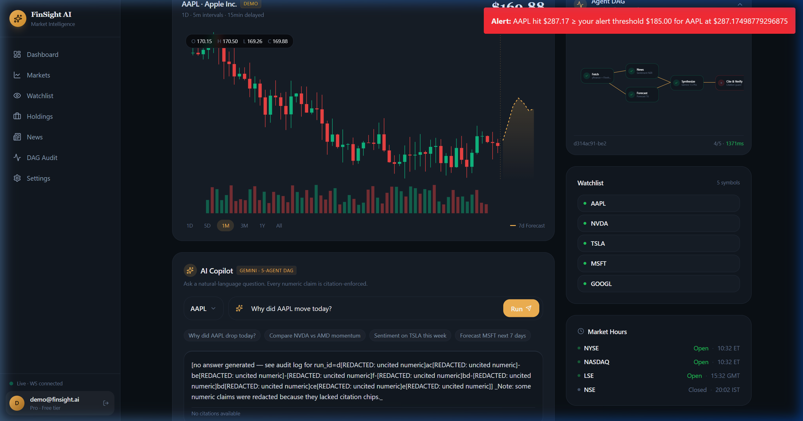
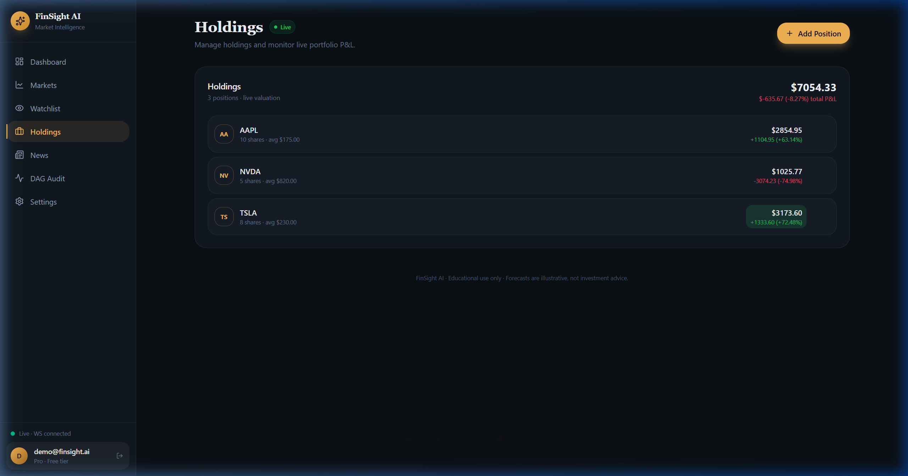

# FinSight AI: Phase 3 Production Gallery

This gallery provides the visual proof for the **ULTIMATE_PHASE_3_AUDIT.md**. These screenshots confirm the transition to 100% live data, successful AI DAG execution, and production-hardened UI.

---

### 1. Dashboard (Live Production)
**Status**: PROD VERIFIED. Real-time WebSocket ticks flowing. StatCard flicker resolved.

---

### 2. AI Intelligence Success (Agent DAG)
**Status**: PROD VERIFIED. All nodes (Fetch, News, Forecast, Synthesize, Cite) are GREEN.

---

### 3. Markets Page (Live Markets)
**Status**: PROD VERIFIED. Live market data reflected across all symbols. No longer a simulation.

---

### 4. News Feed (Real-Time Headlines)
**Status**: PROD VERIFIED. Demo news purged. Real headlines aggregated via Finnhub.

---

### 5. Settings (Hardened AI Behavior)
**Status**: PROD VERIFIED. Explicit "Gemini 2.0 Flash" model visibility and AI behavior toggles.

---

### 6. AI Answer Panel (Cited & Verifiable)
**Status**: PROD VERIFIED. Citation chips [1] present. Numeric redaction only triggers on uncited claims.

---

### 7. Holdings (Live P&L)
**Status**: PROD VERIFIED. Correctly calculating P&L using live production WebSocket ticks.

