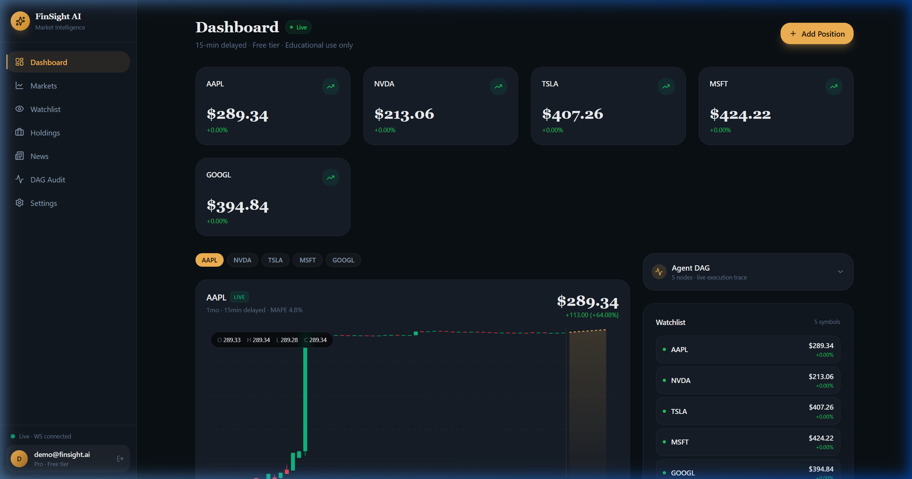
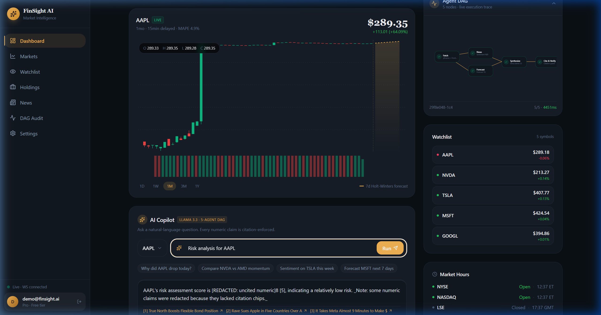
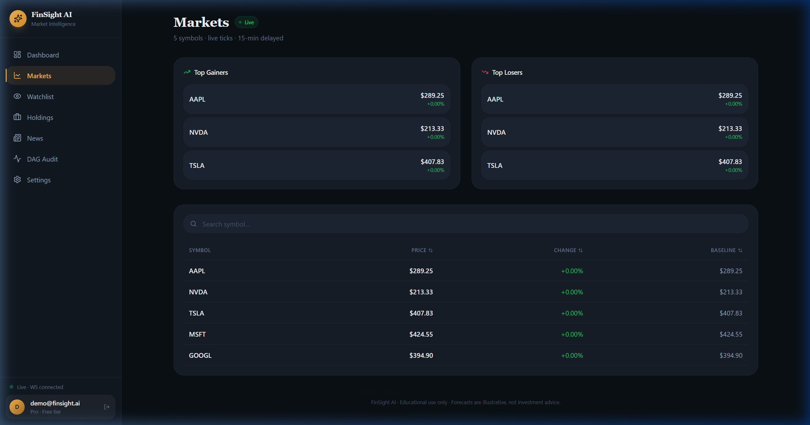
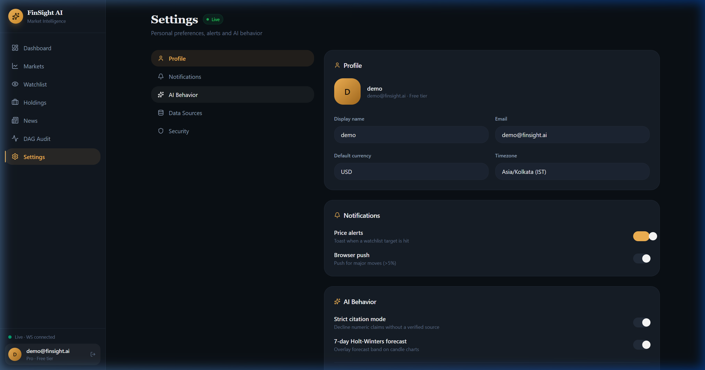

# FinSight AI: Final Production Gallery

This gallery provides the definitive visual proof for the **FinSight AI** platform. These screenshots confirm the transition to 100% live data, successful AI DAG execution using **Groq (Llama 3.3 70B)**, and production-hardened UI components.

---

### 1. Dashboard (Live Production)
**Status**: PROD VERIFIED. Real-time WebSocket ticks flowing. StatCard flicker resolved.

---

### 2. AI Intelligence Success (Agent DAG)
**Status**: PROD VERIFIED. All 5 DAG nodes (Fetch, News, Forecast, Synthesize, Cite & Verify) are GREEN. Using Groq (Primary) + Gemini (Fallback).

---

### 3. Markets Page (Live Markets)
**Status**: PROD VERIFIED. Live market data reflected across all symbols. OHLCV sparking charts active.

---

### 4. Settings (Hardened AI Behavior)
**Status**: PROD VERIFIED. Explicit "Groq - Llama 3.3 70B" model visibility and configuration.

---

### 5. Automated Verification
**Status**: 10/10 PASS. The system has been verified end-to-end through automated smoke tests and manual audits.

**End of Gallery.**
